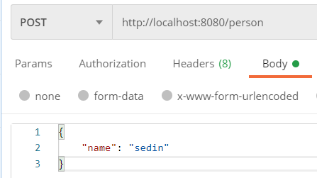
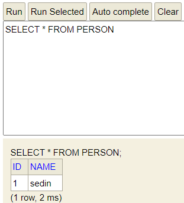

## CheckedException vs UncheckedException

> 면접 질문 중 있었는데 RuntimeException을 상속 하는 예외를 UncheckedException들 이라 하고, 그 이외에 Exception들은 CheckedException 이다.
> 갑자기 질문을 받으니 두 용어가 헷갈려서 거꾸로 말했다가 결국 RuntimeException의 상속 여부를 가지고 질문을 바꿔서 주셨다.
> 다행히 질문에 대한 답은 잘 한것 같았으나, 스스로 용어가 헷갈리고 있단 얘기는 아직 내 것으로 못 만들었단 얘기이므로 이 기회에 학습을 다시하고 정리 해본다.

### 프로그램 오류

- Java에서는 Error(에러) Exception(예외) 두 가지로 구분

### 예외 클래스의 계층구조

- **Object** - 모든 클래스의 조상
- **Throwable** - 모든 에러들과 예외들의 최상위 클래스

  - Throwable javadoc

    ```Java
    /**
    * The {@code Throwable} class is the superclass of all errors and
    * exceptions in the Java language.
    */
    ```

- **Error** - 프로그램 코드에 의해서 수습될 수 없는 심각한 오류
- **Exception** - 프로그램 코드에 의해서 수습될 수 있는 다소 미약한 오류

> Error는 시스템 레벨에서 발생하는 심각한 수준의 오류이기 때문에 개발자가 미리 예측할 수도 없고 처리할 수도 없다. 애플리케이션단 에서는 이를 핸들링 할 수 없기때문이다.
> 그래서 어플리케이션단 에서는 Exception에 대한 처리가 상대적으로 더 중요하다.


### Exception 클래스들 (RuntimeException 클래스와 그 자손 클래스들을 제외한 나머지 클래스들)

> 사용자의 실수와 같은 외적인 요인에 의해 발생하는 예외

### RuntimeException 클래스와 그 자손 클래스들

> 프로그래머의 실수로 발생하는 예외

### **_CheckedException_** 이란 ?

> RuntimeException 클래스와 그 자손 클래스들을 제외한 나머지 클래스들을 지칭
> Compile 시점에 예외처리를 하지 않으면 오류 발생

### **_UncheckedException_** 이란 ?

> Runtime중에 발생 할 수 있는 예외들로 보통 RuntimeException 클래스와 그 자손들을 지칭
> Compile 시점에 오류가 발생하지 않음

|                        | Checked Exception         | Unchecked Exception                            |
| ---------------------- | ------------------------- | ---------------------------------------------- |
| 처리 여부              | 반드시 예외 처리 해야함   | 예외 처리 하지 않아도됨                        |
| 트랜잭션 Rollback 여부 | Rollback 안됌             | Rollback 진행                                  |
| 대표 Exception         | IOException, SQLException | NullPointerException, IllegalArgumentException |

> 위에 표에서 얘기하는 트랜잭션 Rollback 여부에 대해 Spring에서 사용하는 `@Transactional`과 비교 해봤다.

### **@Transactional** javadoc

```java
/**
 * ...
 *
 * <p>If no custom rollback rules are configured in this annotation, the transaction
 * will roll back on {@link RuntimeException} and {@link Error} but not on checked
 * exceptions.
 *
 * ...
 */
@Target({ElementType.TYPE, ElementType.METHOD})
@Retention(RetentionPolicy.RUNTIME)
@Inherited
@Documented
public @interface Transactional {
  ...
}
```

- 위에는 Spring `@Transactional` javadoc의 일부분 이다.
- Rollback 전략은 custom한 전략이 없다면 기본적으로 RuntimeException과 Error에서 롤백 동작을 수행한다. Checked Exception은 예외다.

### 코드로 직접 **Rollback** 테스트 해보기

```bash
# 패키지 구조
├── person
│   ├── Person
│   ├── PersonController
│   ├── PersonNotFoundException
│   ├── PersonRepository
│   └── PersonService
└── CsStudyApplication
```

```java
// Person.java
@Entity
@Getter
@NoArgsConstructor(access = AccessLevel.PROTECTED)
public class Person {

    @Id
    @GeneratedValue(strategy = GenerationType.IDENTITY)
    private Long id;

    private String name;

    @Builder
    private Person(Long id, String name) {
        this.id = id;
        this.name = name;
    }
}
```

```java
// PersonController.java
@RestController
@RequiredArgsConstructor
public class PersonController {

    private final PersonService personService;

    @PostMapping("/person")
    public Person registerPerson(@RequestBody Person person) throws Exception {
        return personService.registerPerson(person);
    }
}
```

```java
// PersonNotFoundException.java
public class PersonNotFoundException extends RuntimeException {

    public PersonNotFoundException(String message) {
        super(message);
    }
}
```

```java
// PersonRepository.java
public interface PersonRepository extends JpaRepository<Person, Long> {

}
```

```java
// PersonService.java
@Service
@RequiredArgsConstructor
@Transactional
public class PersonService {

    private final PersonRepository personRepository;
}
```

### **UncheckedException** (Rollback 여부 - O)

- PersonService에 먼저 RuntimeException을 상속받은 PersonNotFoundException을 발생 시키는 registerPerson 메서드를 만듭니다.

  - UncheckedException이기 때문에 Rollback 대상이다. 확인 해 보자

  ```java
  // PersonService.java
    public Person registerPerson(Person person) {
        personRepository.save(person);

        throw new PersonNotFoundException("회원을 찾을 수 없음");
    }
  ```

  - 
  - 

  ```log
  2022-11-07 20:13:20.965 DEBUG 9516 --- [nio-8080-exec-4] org.hibernate.SQL                        :
    insert
    into
        person
        (id, name)
    values
        (default, ?)
  Hibernate:
    insert
    into
        person
        (id, name)
    values
        (default, ?)
  2022-11-07 20:13:20.970 TRACE 9516 --- [nio-8080-exec-4] o.h.type.descriptor.sql.BasicBinder      : binding parameter [1] as [VARCHAR] - [sedin]
  2022-11-07 20:13:21.012 ERROR 9516 --- [nio-8080-exec-4] o.a.c.c.C.[.[.[/].[dispatcherServlet]    : Servlet.service() for servlet [dispatcherServlet] in context with path [] threw exception [Request processing failed; nested exception is com.sedin.csstudy.person.PersonNotFoundException: 회원을 찾을 수 없음] with root cause
  ```

  - 

  - 유저 생성 요청을 보낼 때 로그에 insert query가 나간것을 확인 할 수 있고, h2-console에서 재 조회해도 person은 조회되지 않는다.
  - 즉, UncheckedException 예외는 rollback 대상이다.

### **CheckedException** (Rollback 여부 - X)

- 다음으로 registerPerson 메서드를 수정해서 CheckedException 예외를 던져보자.

  - CheckedException 예외는 Rollback 대상이 아니다. 확인 해 보자

  ```java
  // PersonService.java
  public Person registerPerson(Person person) throws Exception {
      personRepository.save(person);

      throw new Exception();
  }
  ```

  - 
  - 

  ```log
  2022-11-07 20:28:26.550 DEBUG 7396 --- [nio-8080-exec-2] org.hibernate.SQL                        :
    insert
    into
        person
        (id, name)
    values
        (default, ?)
  Hibernate:
    insert
    into
        person
        (id, name)
    values
        (default, ?)
  2022-11-07 20:28:26.559 TRACE 7396 --- [nio-8080-exec-2] o.h.type.descriptor.sql.BasicBinder      : binding parameter [1] as [VARCHAR] - [sedin]
  2022-11-07 20:28:26.636 ERROR 7396 --- [nio-8080-exec-2] o.a.c.c.C.[.[.[/].[dispatcherServlet]    : Servlet.service() for servlet [dispatcherServlet] in context with path [] threw exception [Request processing failed; nested exception is java.lang.Exception] with root cause
  ```

  - 

  - 유저 생성 요청을 보낼 때 로그에 insert query가 나간것을 확인 할 수 있고, h2-console에서 재 조회시 person이 조회 된다.
  - 즉, CheckedException 예외는 rollback 대상이 아니다.

### 결론

- CheckedException는 try~catch 구문 같은걸로 예외를 복구처리가 가능해서 rollback 대상이 아니다. 자주는 안 쓰이는듯..
- CheckedException은 보통 더 구체적인 UncheckedException 예외를 던져서 로직을 끊어 낸다.
- Spring `@Transactional` scope에서 발생한 UncheckedException 예외는 Rollback 처리 된다.

### Reference

- https://docs.oracle.com/javase/tutorial/essential/exceptions/throwing.html
