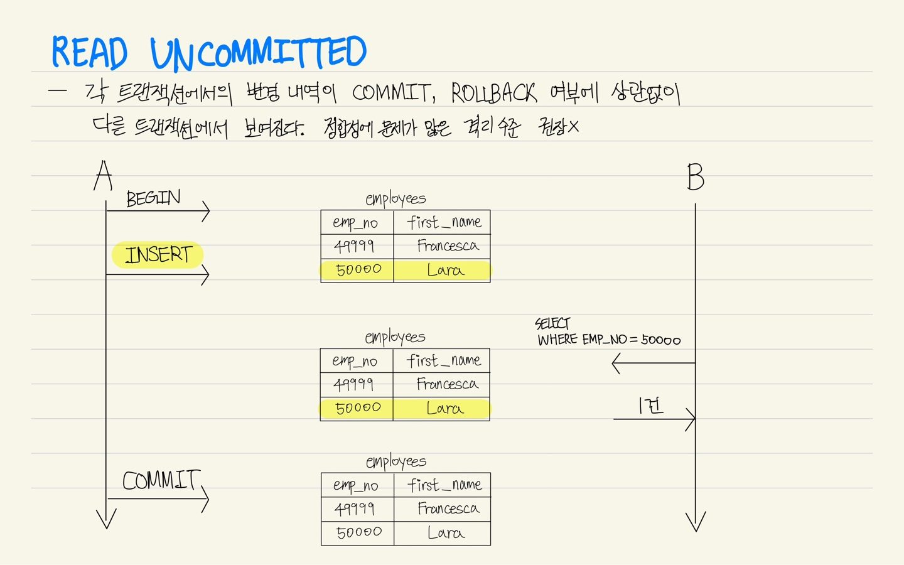
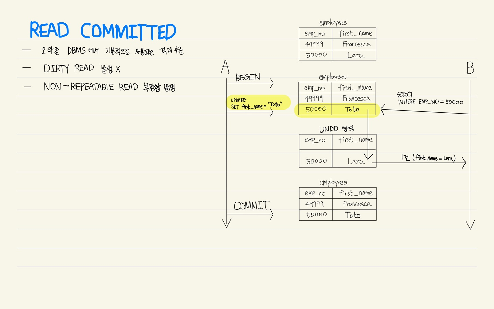
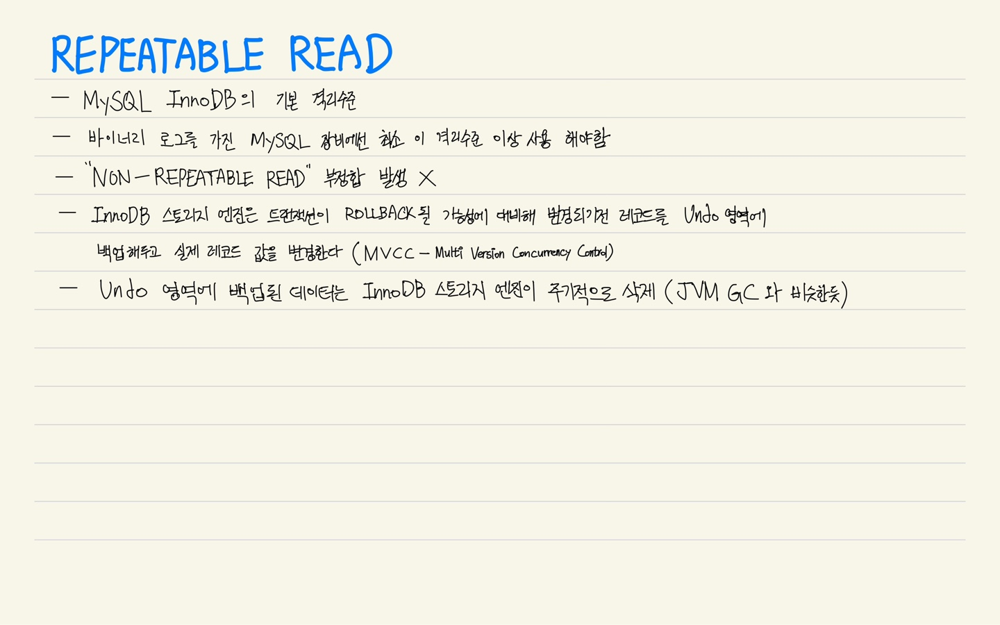
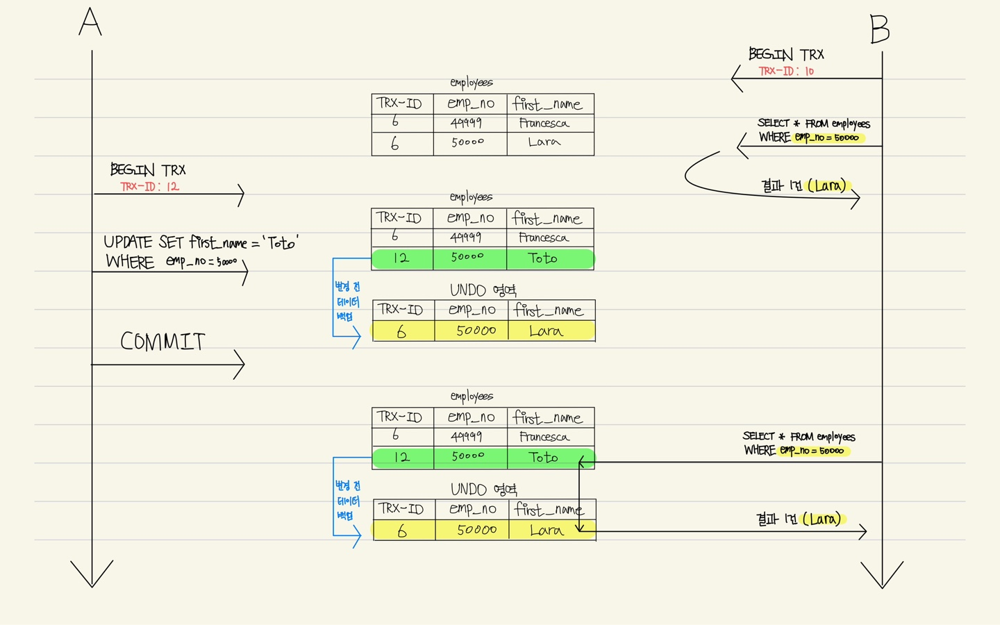

### Transaction Isolation Level (트랜잭션 격리 수준)

- [MySQL 실습환경 세팅](#mysql-%EC%8B%A4%EC%8A%B5)
- [READ UNCOMMITTED](#read-uncommitted)
- [READ COMMITTED](#read-committed)
- [REPEATABLE READ](#repeatable-read)
- [SERIALIZABLE](#serializable)

|                      | <center>DIRTY READ</center> | <center>NON - REPEATABLE READ</center> | <center>PHANTOM READ</center> |
| :------------------- | :-------------------------: | :------------------------------------: | :---------------------------: |
| **READ UNCOMMITTED** |              O              |                   O                    |               O               |
| **READ COMMITTED**   |              X              |                   O                    |               O               |
| **REPEATABLE READ**  |              X              |                   X                    |      O (InnoDB는 발생 X)      |
| **SERIALIZABLE**     |              X              |                   X                    |               X               |

- **DIRTY READ** : 어떤 트랜잭션에서 처리한 작업이 완료되지 않았는데도 다른 트랜잭션에서 볼 수 있게 되는 현상
- **NON - REPEATABLE READ** : 하나의 트랜잭션 내에서 똑같은 SELECT 쿼리를 실행했을 때는 항상 같은 결과를 가져야하는데 (이를 REPEATABLE READ 정합성 이라 함) 이 정합성이 깨지는 것을 뜻 함
- **PHANTOM READ** : 다른 트랜잭션에서 수행한 변경 작업에 의해 레코드가 보였다가 안 보였다가 하는 현상

### MySQL 실습

- Docker로 MySQL을 띄워서 사용 해보자
- 기본 세팅하기

```bash
docker run -it --name db001 -e MYSQL_ROOT_PASSWORD=db001 -d mysql:latest    # MySQL 최신 버전을 하나 daemon으로 띄움
docker exec -it db001 bash                                                  # bash쉘로 접속
mysql -uroot -p                                                             # MySQL 접속
create database testdb;                                                     # MySQL에서 사용할 테스트용 데이터 베이스 생성
use testdb;                                                                 # 방금 만든 테스트용 데이터 베이스 사용

CREATE TABLE employees(                                                     # 직원 테이블 생성
emp_no int(10) NOT NULL AUTO_INCREMENT,
first_name VARCHAR(20) NOT NULL,
CONSTRAINT employees_PK PRIMARY KEY (emp_no)
);

mysql> show tables;                                                         # 잘 생성 되었는지 확인
+------------------+
| Tables_in_testdb |
+------------------+
| employees        |
+------------------+
1 row in set (0.00 sec)

insert into employees(emp_no, first_name) values(49999, 'Francesca');    # 테스트용 데이터 추가

mysql> select * from employees;                                             # 데이터 확인
+--------+------------+
| emp_no | first_name |
+--------+------------+
|  49999 | Francesca  |
+--------+------------+
1 rows in set (0.00 sec)


mysql> show variables like 'transaction_isolation';                         # 트랜잭션 격리 수준 확인
+-----------------------+-----------------+
| Variable_name         | Value           |
+-----------------------+-----------------+
| transaction_isolation | REPEATABLE-READ |
+-----------------------+-----------------+
1 row in set (0.01 sec)

```

- MySQL에 접속한 클라이언트 세션에 대한 격리수준 설정

```bash
SET SESSION TRANSACTION ISOLATION LEVEL READ UNCOMMITTED; # READ_UNCOMMITTED
SET SESSION TRANSACTION ISOLATION LEVEL READ COMMITTED;   # READ_COMMITTED
SET SESSION TRANSACTION ISOLATION LEVEL REPEATABLE READ;  # REPEATABLE READ
SET SESSION TRANSACTION ISOLATION LEVEL SERIALIZABLE;     # SERIALIZABLE
```

### **READ UNCOMMITTED**

- 각 트랜잭션에서의 변경 내역이 COMMIT, ROLLBACK 여부에 상관없이 다른 트랜잭션에서 보여진다(**Dirty Read**).
- 정합성에 문제가 많은 격리수준
- 권장 x



1. 터미널을 두개 띄워서 각 세션의 **Transaction Isolation Level**을 **READ UNCOMMITTED**로 변경 해준다.

```bash
# 1번, 2번 각 Terminal
SET SESSION TRANSACTION ISOLATION LEVEL READ UNCOMMITTED; # READ_UNCOMMITTED로 설정
SHOW VARIABLES LIKE 'transaction_isolation';              # 격리수준 체크

mysql> SHOW VARIABLES LIKE 'transaction_isolation';
+-----------------------+------------------+
| Variable_name         | Value            |
+-----------------------+------------------+
| transaction_isolation | READ-UNCOMMITTED |
+-----------------------+------------------+
1 row in set (0.00 sec)
```

2. 먼저 **1번 터미널에 띄워둔 MySQL서버의 트랜잭션을 시작** 해 줍니다.
   그 뒤 **emp_no=50000, first_name='Lara'를 가지는 사원을 추가** 합니다.
   아직 **1번 터미널의 트랜잭션은 끝나지 않은 상태**로 둡니다.

```bash
# 1번 터미널
mysql> select * from employees;                                     # 트랜잭션 시작 전 데이터 1건 확인
+--------+------------+
| emp_no | first_name |
+--------+------------+
|  49999 | Francesca  |
+--------+------------+
1 rows in set (0.00 sec)

START TRANSACTION;                                                  # 트랜잭션 시작
INSERT INTO employees(emp_no, first_name) VALUES(50000, 'Lara');    # 새 사원 추가
```

3. **2번 터미널에 띄워둔 MySQL 서버**에서 '**SELECT emp_no, first_name FROM employees**' 쿼리를 실행 해 줍니다.

- 1번 터미널의 트랜잭션이 끝나기도 전에 다른 트랜잭션에서 커밋돼지 않은 정보를 읽을 수 있다(**Dirty Read 발생 O**).

```bash
# 2번 터미널
mysql> select * from employees;  # 2번 터미널에서 데이터 확인
+--------+------------+
| emp_no | first_name |
+--------+------------+
|  49999 | Francesca  |
|  50000 | Lara       |
+--------+------------+
2 rows in set (0.00 sec)
```

4. **1번 터미널의 트랜잭션**을 **COMMIT** 해 줍니다.

```bash
# 1번 터미널
COMMIT;
```

5. **READ_UNCOMMITTED 격리 수준**은 트랜잭션이 시작되고 커밋되지 않은 데이터에 접근 가능하다.

### **READ COMMITTED**

- Oracle DBMS의 기본 격리수준
- 온라인 서비스에서 가장 많이 선택되는 격리수준
- **Dirty Read**는 발생하지 않음
- 하지만 **READ COMMITTED** 격리수준에서도 **NON-REPEATABLE READ** 부정합 문제가 있음



1. **READ UNCOMMITTED**격리수준 실습 때 띄어놓은 두 개의 터미널을 그대로 사용.
   각 세션의 **Transaction Isolation Level**을 **READ COMMITTED**로 변경 해준다.

```bash
# 1번, 2번 각 Terminal
SET SESSION TRANSACTION ISOLATION LEVEL READ COMMITTED; # READ_COMMITTED로 설정
SHOW VARIABLES LIKE 'transaction_isolation';              # 격리수준 체크

mysql> SHOW VARIABLES LIKE 'transaction_isolation';
+-----------------------+----------------+
| Variable_name         | Value          |
+-----------------------+----------------+
| transaction_isolation | READ-COMMITTED |
+-----------------------+----------------+
1 row in set (0.00 sec)
```

2. **먼저 1번 터미널에 띄워둔 MySQL서버의 트랜잭션을 시작** 해 줍니다.
   1번 터미널에서 '**SELECT \* FROM employees**' 쿼리로 조회

```bash
# 1번 터미널
START TRANSACTION;                                               # 1번 터미널 트랜잭션 시작

mysql> select * from employees;                                  # 트랜잭션 시작 후 데이터 2건 확인
+--------+------------+
| emp_no | first_name |
+--------+------------+
|  49999 | Francesca  |
|  50000 | Lara       |
+--------+------------+
2 rows in set (0.00 sec)
```

3. **2번 터미널에 띄워둔 MySQL서버의 트랜잭션을 시작** 해 줍니다.
   2번 터미널에서 '**SELECT \* FROM employees**' 쿼리로 조회

```bash
# 2번 터미널
START TRANSACTION;                                               # 2번 터미널 트랜잭션 시작

mysql> select * from employees;                                  # 트랜잭션 시작 후 데이터 2건 확인
+--------+------------+
| emp_no | first_name |
+--------+------------+
|  49999 | Francesca  |
|  50000 | Lara       |
+--------+------------+
2 rows in set (0.00 sec)
```

4. 다시 **1번 터미널**에서 '**UPDATE employees SET first_name="Toto" WHERE first_name="Lara"**' 쿼리를 실행 합니다.
   아직 **1번 터미널의 트랜잭션은 끝나지 않은 상태**로 둡니다.

```bash
# 1번 터미널
UPDATE employees SET first_name="Toto" WHERE first_name="Lara";  # UPDATE 쿼리 실행
```

5. **2번 터미널**에서 **다시 조회** 하기

- 1번 터미널의 트랜잭션이 끝나기 전에는 다른 트랜잭션에서 커밋돼지 않은 정보를 읽을 수 없다 (**Dirty Read 발생 X**)

```bash
# 2번 터미널
mysql> SELECT * FROM employees;
+--------+------------+
| emp_no | first_name |
+--------+------------+
|  49999 | Francesca  |
|  50000 | Lara       |
+--------+------------+
2 rows in set (0.00 sec)
```

6. **1번 터미널 트랜잭션 COMMIT**하기

```bash
# 1번 터미널
mysql> COMMIT;                        # 1번 터미널 트랜잭션 COMMIT
Query OK, 0 rows affected (0.04 sec)
```

7. **2번 터미널**에서 **다시 조회** 하기

- **NON-REPEATABLE READ**부정합 발생(같은 트랜잭션 내에서 SELECT 쿼리의 결과는 항상 동일 해야함)

```bash
# 2번 터미널
mysql> SELECT * FROM employees;   # 1번 터미널 COMMIT 후 재 조회
+--------+------------+
| emp_no | first_name |
+--------+------------+
|  49999 | Francesca  |
|  50000 | Toto       |
+--------+------------+
2 rows in set (0.01 sec)
```

8. **2번 터미널 트랜잭션 COMMIT**하기

```bash
# 2번 터미널
mysql> COMMIT;                        # 2번 터미널 트랜잭션 COMMIT
Query OK, 0 rows affected (0.04 sec)
```

9. **READ COMMITTED 격리수준**에선 **Dirty Read** 부정합은 발생하지 않지만, **NON-REPEATABLE READ** 부정합은 발생한다.

### **REPEATABLE READ**

- **MySQL InnoDB**의 기본 **격리수준**
- 바이너리 로그를 가진 MySQL 장비에선 최소 **REPEATABLE READ** 격리수준 이상을 사용 해야 함
- **"NON-REPEATABLE READ"** 부정합 발생 X
- **InnoDB 스토리지 엔진**은 트랜잭션이 ROLLBACK될 가능성에 대비해 변경되기전 레코드를 **Undo 영역**에 백업 해두고,
  실제 레코드 값을 변경한다 (**MVCC - Multi Version Concurrency Control**)
- **Undo 영역에 백업된 데이터**는 InnoDB 스토리지 엔진이 필요없다고 판단되는 시점에 **주기적으로 삭제** (JVM GC와 비슷 한 듯)




1. **READ UNCOMMITTED**격리수준 실습 때 띄어놓은 두 개의 터미널을 그대로 사용.
   각 세션의 **Transaction Isolation Level**을 **REPEATABLE READ**로 변경 해준다.

```bash
# 1번, 2번 각 Terminal
SET SESSION TRANSACTION ISOLATION LEVEL REPEATABLE READ; # READ_COMMITTED로 설정
SHOW VARIABLES LIKE 'transaction_isolation';              # 격리수준 체크

mysql> SHOW VARIABLES LIKE 'transaction_isolation';
+-----------------------+-----------------+
| Variable_name         | Value           |
+-----------------------+-----------------+
| transaction_isolation | REPEATABLE-READ |
+-----------------------+-----------------+
1 row in set (0.00 sec)
```

2. **이번엔 2번 터미널에 띄워둔 MySQL서버의 트랜잭션을 먼저 시작** 해 줍니다.
   2번 터미널에서 '**SELECT \* FROM employees WHERE emp_no=50000**' 쿼리로 조회

```bash
# 2번 터미널
START TRANSACTION;                                               # 2번 터미널 트랜잭션 시작

mysql> SELECT * FROM employees WHERE emp_no=50000;
+--------+------------+
| emp_no | first_name |
+--------+------------+
|  50000 | Lara       |
+--------+------------+
1 row in set (0.00 sec)
```

3. **1번 터미널에 띄워둔 MySQL서버의 트랜잭션을 시작** 해 줍니다.
   다시 **1번 터미널**에서 '**UPDATE employees SET first_name='Toto' WHERE emp_no=50000**' 쿼리를 실행 합니다.
   그리고 **1번 터미널의 트랜잭션을 COMMIT**해 줍니다.

```bash
# 1번 터미널
START TRANSACTION;                                                # 1번 터미널 트랜잭션 시작
UPDATE employees SET first_name='Toto' WHERE emp_no=50000;        # UPDATE 쿼리 실행
COMMIT;                                                           # 1번 터미널 트랜잭션 커밋
```

4. **2번 터미널**에서 **다시 조회** 하기 ('**SELECT \* FROM employees WHERE emp_no=50000**' 쿼리 실행)

- 1번 터미널의 트랜잭션이 끝났지만, 2번 터미널에서 재 조회시 처음 조회했던 결과를 그대로 얻는다 (**NON-REPEATABLE READ 부정합 발생 X**)

```bash
# 2번 터미널
mysql> SELECT * FROM employees WHERE emp_no=50000;
+--------+------------+
| emp_no | first_name |
+--------+------------+
|  50000 | Lara       |
+--------+------------+
1 row in set (0.00 sec)
```

5. **2번 터미널 트랜잭션 COMMIT**하기

```bash
# 2번 터미널
mysql> COMMIT;                        # 2번 터미널 트랜잭션 COMMIT
Query OK, 0 rows affected (0.04 sec)
```

6. **2번 터미널 COMMIT 후 다시 조회** 하기

- 이제 1번 트랜잭션의 결과가 반영된 수정된 레코드 값이 보인다.

```bash
# 2번 터미널
mysql> SELECT * FROM employees WHERE emp_no=50000;
+--------+------------+
| emp_no | first_name |
+--------+------------+
|  50000 | Toto       |
+--------+------------+
1 row in set (0.00 sec)
```

7. **REPEATABLE READ 격리수준**에선 **Dirty Read** 부정합과 **NON-REPEATABLE READ** 부정합은 발생하지 않는다.

### **SERIALIZABLE**
